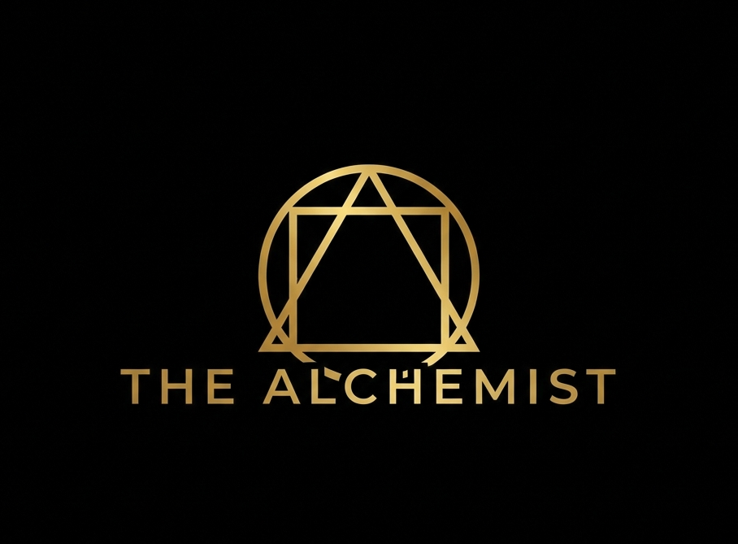

# ⚜️ The Alchemist

> **"I don't just type code; I orchestrate it."**

Welcome to the digital realm of **The Alchemist** — a next-generation developer portfolio and Resume platform built for the **Vibe Coder** era.



## 🔮 Overview

This is not a template. It is a statement. 
Built with **React**, **Three.js**, and **Taiwind CSS**, this project transforms a simple resume into an interactive storytelling experience.

### ✨ Features

- **The Vibe Coder Persona**: Radical honesty. Orchestration over syntax. Impact over output.
- **Digital Alchemy Resume**: A fully editable, printable resume generator that adapts to your vibe.
  - **Live Preview**: See changes in real-time.
  - **PDF Export**: Generate high-quality A4 PDFs automatically.
  - **Dynamic Sections**: Skills, Hobbies (like Prompt Engineering!), and Experience.
- **3D Hero Scene**: A floating, interactive 3D ring (Ionic Ring) that captivates visitors instantly.
- **Minimalist Aesthetic**: Gold accents on absolute black. Pure elegance.

## 🛠️ The Stack

- **Framework**: React + Vite
- **Styling**: Vanilla CSS (CSS Modules approach) + Tailwind concepts
- **3D Engine**: React Three Fiber / Drei
- **Animations**: Framer Motion
- **PDF Engine**: html2pdf.js

## ⚡ Quick Start

1.  **Install the magic**:
    ```bash
    pnpm install
    ```

2.  **Ignite the server**:
    ```bash
    pnpm dev
    ```

3.  **Transmute**:
    Open [http://localhost:5173](http://localhost:5173) and witness the alchemy.

## 📝 Usage

1.  **Edit Resume**: Go to `/the-alchemist` (or click "My Resume" on home).
2.  **Customize**: Click the **"Open Editor"** button at the bottom.
3.  **Export**: Click "Download PDF" to materialize your resume into a file.

---

*Crafted with 🖤 and ✨ by [Fazalurrehman](https://github.com/TDOMxHUNTER)*
